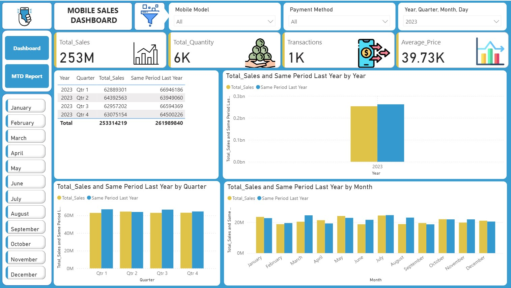
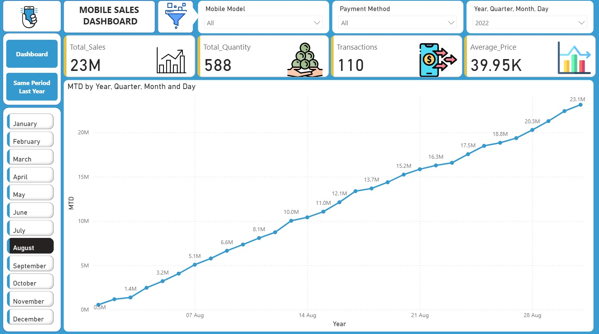

# Power_BI_Mobile_Sales_Dashboard

 

## Overview

This repository contains a comprehensive **Mobile Sales Dashboard** built using Power BI, visualizing key sales metrics for mobile devices across multiple dimensions such as time periods, payment methods, mobile models, brands, locations, and customer ratings. The dashboard is divided into three interactive pages, providing insights into sales performance, trends, and comparisons year-over-year (YoY).

The dashboard analyzes data from 2022 and 2023, highlighting total sales, quantities, transactions, average prices, and more. It helps stakeholders track growth, identify top-performing products and regions, and make data-driven decisions for sales strategies.

### Key Insights from the Dashboard
- **Total Sales Growth**: From 23M in 2022 to 253M in 2023 (significant YoY increase).
- **Top Brands**: Samsung and OnePlus lead in sales volume.
- **Popular Models**: iPhone SE, OnePlus Nord, and Galaxy Note 20 dominate.
- **Payment Trends**: UPI and Debit Cards are the most used methods.
- **Geographic Hotspots**: High sales in cities like Delhi, Mumbai, and Bangalore.
- **Seasonal Patterns**: Sales peak in Q1 and Q3, with variations by month and day of the week.

## Dashboard Pages

The dashboard consists of three pages, each focusing on different aspects of the data:

### Page 1: Geographic & Detailed Breakdown 
- **Key Metrics**: Total Sales (769M), Total Quantity (19K), Transactions (4K), Average Price (40.11K).
- **Visualizations**:
  - Map of sales by city (e.g., Delhi, Mumbai, Bangalore).
  - Line chart for quantity by month.
  - Bar charts for ratings by status and transactions by payment method.
  - Pie chart for payment method distribution.
  - Bar charts for sales by brand/model and by day of the week.
- **Screenshot**:
  

### Page 2: Quarterly & Monthly Analysis 
- **Key Metrics**: Total Sales (253M), Total Quantity (6K), Transactions (1K), Average Price (39.73K).
- **Visualizations**:
  - Stacked bar charts for quarterly and monthly sales vs. same period last year.
  - Table summarizing sales by quarter.
  - Filters: Mobile Model, Payment Method, Time Granularity.
- **Screenshot**:
  

### Page 3:  Overview & Trends 
- **Key Metrics**: Total Sales (23M), Total Quantity (588), Transactions (110), Average Price (39.95K).
- **Visualizations**:
  - Line chart showing monthly sales trends (MTD by Year/Quarter/Month/Day).
  - Bar charts for sales comparison with same period last year.
  - Filters: Mobile Model, Payment Method, Time Granularity (Year/Quarter/Month/Day).
- **Screenshot**:
   

## Technologies Used
- **Power BI**: For dashboard creation, data modeling, and visualizations.
- **Data Sources**: Excel files with sales data (e.g., transactions, products, locations). 
- **Libraries/Integrations**: DAX for calculations, Power Query for data transformation.

## Acknowledgments
- Built with ❤️ using Power BI. 
